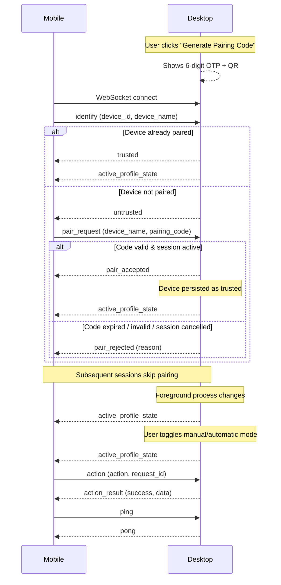

# Wire Protocol

## Status: Draft v0.1.0-draft

The protocol is currently **implemented ad-hoc in the desktop codebase**
(`apps/desktop/src/agent.rs`). A formal shared definition will be created under
`shared/protocol/` as the system stabilizes.

## Design

- **Transport**: WebSocket (TCP, plaintext in v1).
- **Message format**: JSON, one frame per message.
- **Direction**: Bidirectional after connection is established.

## Message catalog

| Message | Sender | Receiver | Purpose |
|---------|--------|----------|---------|
| `identify` | Mobile | Desktop | Identify the connecting device before trust evaluation |
| `trusted` | Desktop | Mobile | Confirm device is already paired and trusted |
| `untrusted` | Desktop | Mobile | Indicate device is not paired |
| `pair_request` | Mobile | Desktop | Request to begin trust establishment |
| `pair_accepted` | Desktop | Mobile | Confirm pairing was approved by user |
| `pair_rejected` | Desktop | Mobile | Indicate pairing was declined or timed out |
| `action` | Mobile | Desktop | Request execution of a remote action |
| `action_result` | Desktop | Mobile | Result of action execution |
| `ping` | Mobile | Desktop | Keepalive probe |
| `pong` | Desktop | Mobile | Keepalive response |
| `active_profile_state` | Desktop | Mobile | Active runtime Profile projection (v0.3) |
| `error` | Desktop | Mobile | Error response to invalid messages |

## Implementation status

| Message | Status |
|---------|--------|
| `identify` | ✅ Implemented |
| `trusted` | ✅ Implemented |
| `untrusted` | ✅ Implemented |
| `pair_request` | ✅ Implemented |
| `pair_accepted` | ✅ Implemented |
| `pair_rejected` | ✅ Implemented |
| `action` | ✅ Implemented |
| `action_result` | ✅ Implemented |
| `ping` | ✅ Implemented |
| `pong` | ✅ Implemented |
| `error` | ✅ Implemented |
| `active_profile_state` | ❌ v0.3 — not yet implemented |
| `pair_challenge` | ❌ Not used | ADR-002 was implemented without new messages — OTP is an optional `pairing_code` field on `pair_request`. |
| `pair_verify` | ❌ Not used | Same as above. |

All payload examples below are **Draft v0.1.0-draft** and may change until
the wire format is frozen at v1.

### `identify`

- **Sender:** Mobile
- **Receiver:** Desktop
- **Purpose:** Identify the connecting device. Sent immediately after WebSocket
  open, before any other message.

```json
{ "type": "identify", "device_id": "android-RMX3392", "device_name": "Pixel 7" }
```

### `trusted`

- **Sender:** Desktop
- **Receiver:** Mobile
- **Purpose:** Confirm the identified device is already paired and trusted.
  Subsequent messages from this device are accepted immediately.

```json
{ "type": "trusted", "device_id": "amd-MY-DESKTOP" }
```

### `untrusted`

- **Sender:** Desktop
- **Receiver:** Mobile
- **Purpose:** Indicate the device is not paired. Mobile should follow up with
  a `pair_request` if the user wants to initiate pairing.

```json
{ "type": "untrusted", "message": "Device not paired. Send pair_request to initiate pairing." }
```

### `pair_request`

- **Sender:** Mobile
- **Receiver:** Desktop
- **Purpose:** Request to pair. Desktop validates the OTP code (if provided) or
  falls back to tray approval.

```json
{ "type": "pair_request", "device_name": "My Phone" }
{ "type": "pair_request", "device_name": "My Phone", "pairing_code": "482731" }
```

### `pair_accepted`

- **Sender:** Desktop
- **Receiver:** Mobile
- **Purpose:** Confirm the user approved the pairing. The device is now trusted.

```json
{ "type": "pair_accepted", "device_id": "amd-MY-DESKTOP" }
```

### `pair_rejected`

- **Sender:** Desktop
- **Receiver:** Mobile
- **Purpose:** Indicate the user declined the pairing, the pairing timed out,
  or OTP validation failed. The `reason` field is a stable machine-readable
  code. Mobile maps codes to display text locally.

| Code | Meaning |
|------|---------|
| `code_mismatch` | OTP code does not match the active session |
| `expired` | Pairing session has expired (5 min lifetime) |
| `cancelled` | User cancelled pairing from Desktop GUI |
| `already_used` | Pairing code was already consumed |
| `no_session` | No active pairing session on Desktop |
| `user_declined` | User explicitly declined via tray approval |
| `timeout` | Tray approval timed out (120s) |

```json
{ "type": "pair_rejected", "device_id": "amd-MY-DESKTOP", "reason": "code_mismatch" }
{ "type": "pair_rejected", "device_id": "amd-MY-DESKTOP", "reason": "timeout" }
```

### `action`

- **Sender:** Mobile
- **Receiver:** Desktop
- **Purpose:** Request execution of a remote action. Only accepted from trusted
  (paired) devices.

```json
{ "type": "action", "action": "lock", "device_id": "amd-MY-DESKTOP", "request_id": "req-001" }
```

### `action_result`

- **Sender:** Desktop
- **Receiver:** Mobile
- **Purpose:** Result of an action execution. Includes success status and
  optional data.

```json
{ "type": "action_result", "request_id": "req-001", "success": true, "data": {} }
```

### `ping`

- **Sender:** Mobile
- **Receiver:** Desktop
- **Purpose:** Keepalive probe. Desktop disconnects clients that do not send
  periodic pings.

```json
{ "type": "ping" }
```

### `pong`

- **Sender:** Desktop
- **Receiver:** Mobile
- **Purpose:** Keepalive response. Echoes the original ping for correlation.

```json
{ "type": "pong", "echo": {}, "deviceId": "192.168.1.5:9742" }
```

### `error`

- **Sender:** Desktop
- **Receiver:** Mobile
- **Purpose:** Returned when a message is invalid, missing required fields, or
  sent in the wrong state (e.g., action from an unpaired device).

```json
{ "type": "error", "message": "Device not paired. Complete pairing first." }
```

### `active_profile_state`

- **Sender:** Desktop
- **Receiver:** Mobile
- **Purpose:** Projects the active runtime Profile definition to connected
  clients. Sent after authorization (`trusted` or `pair_accepted`) and on
  every subsequent state change (Profile switch, SelectionMode change).
  Idempotent — the full state is sent each time.
- **Direction:** Desktop-initiated (push). Only sent to trusted clients.
- **v0.3:** Not yet implemented.

#### Payload contract

| Field | Type | Nullable | Description |
|---|---|---|---|
| `type` | string | no | Always `"active_profile_state"` |
| `selection_mode` | string | no | `"automatic"` or `"manual"` |
| `profile` | object | yes | Complete active Profile definition or `null` |
| `profile.id` | string | no | ProfileId as string |
| `profile.name` | string | no | Display name |
| `profile.pages` | array | no | Array of Page objects (may be empty) |
| `pages[].id` | string | no | PageId as string |
| `pages[].name` | string | no | Display name |
| `pages[].buttons` | array | no | Array of Button objects (may be empty) |
| `buttons[].id` | string | no | ButtonId as string |
| `buttons[].label` | string | no | Display label |
| `buttons[].action` | object | no | Action reference |
| `action.action_name` | string | no | Registered action name |
| `action.payload` | object | no | Action-specific arguments |

```json
{
  "type": "active_profile_state",
  "selection_mode": "automatic",
  "profile": {
    "id": "abc123...",
    "name": "Development",
    "pages": [
      {
        "id": "def456...",
        "name": "Main",
        "buttons": [
          {
            "id": "ghi789...",
            "label": "Open Chrome",
            "action": {
              "action_name": "launch",
              "payload": { "app": "chrome" }
            }
          }
        ]
      }
    ]
  }
}
```

Null profile (no active Profile):

```json
{
  "type": "active_profile_state",
  "selection_mode": "automatic",
  "profile": null
}
```

## Sequence (v0.3 pairing + profile projection flow)



## Protocol Roadmap

- TLS for transport security.
- Message versioning in the header.
- Protobuf or similar for schema enforcement.
