# v0.5 — Sequence Diagrams

**Status:** Draft
**Date:** 2026-07-15

Normative references: ADR-021, v0.5-scope.md, v0.5-protocol-contract.md,
v0.4-sequences.md.

---

## 1. Legend

| Symbol | Meaning |
|--------|---------|
| D | Desktop |
| M | Mobile |
| PE | ProjectionEngine |
| PP_CSS | PublicationPolicy + Publisher for control_surface_state |
| ChB | watch channel B (control_surface_state) |
| APS | active_profile_state |
| CSS | control_surface_state |

---

## 2. Connection + Trusted Handshake

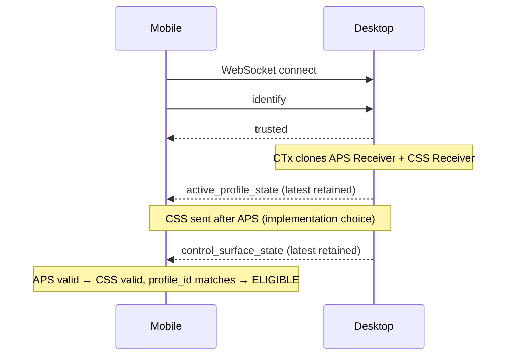

The implementation MAY send APS then CSS sequentially for deterministic
display. Mobile correctness does NOT depend on this ordering.

---

## 3. Connection + Pairing

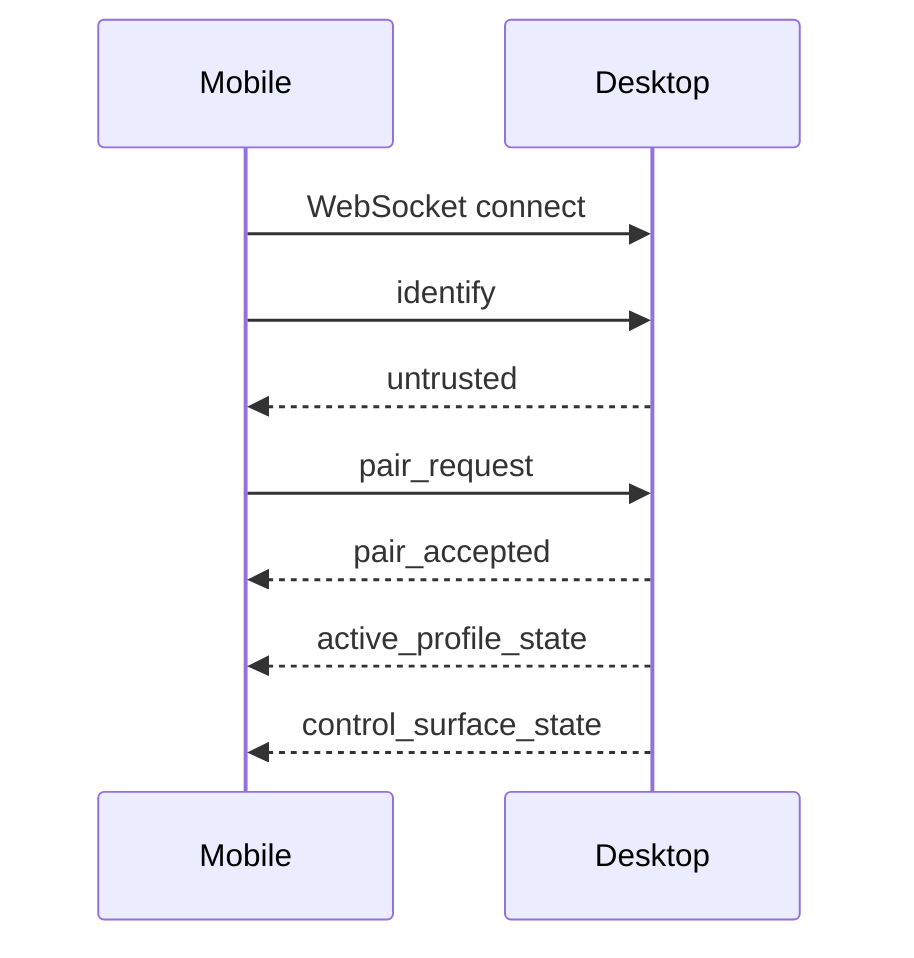

---

## 4. Active Profile Transition — APS arrives before CSS

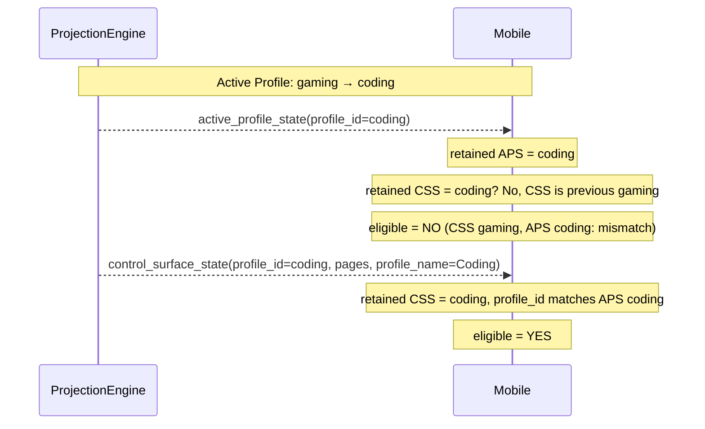

Safe convergence. Temporary ineligibility is architecturally valid.

---

## 5. Active Profile Transition — CSS arrives before APS

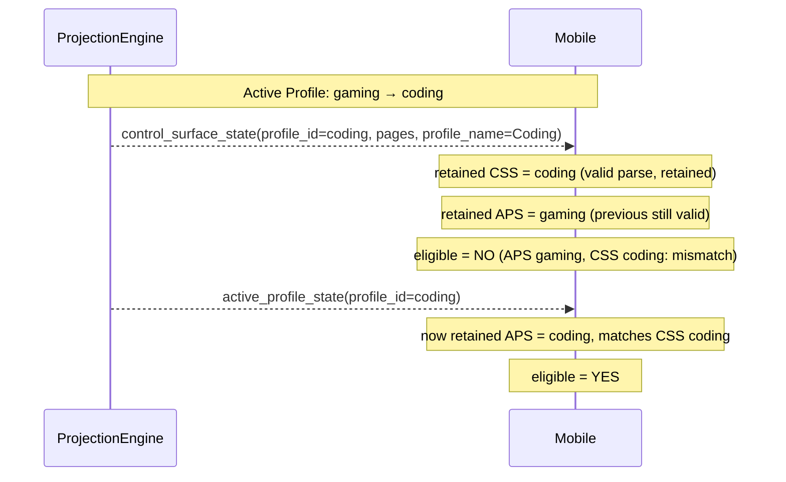

CSS arrival before APS is architecturally valid. CSS retained with full
state, merely ineligible until APS converges.

---

## 6. Document Edit — Button relabeled

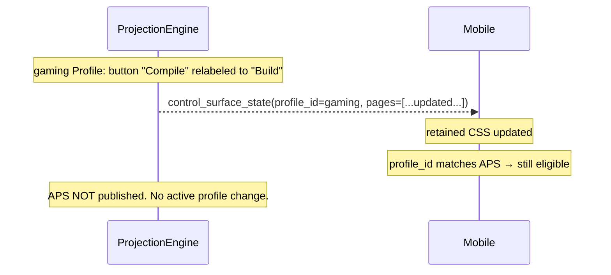

---

## 7. Document Edit — Page added

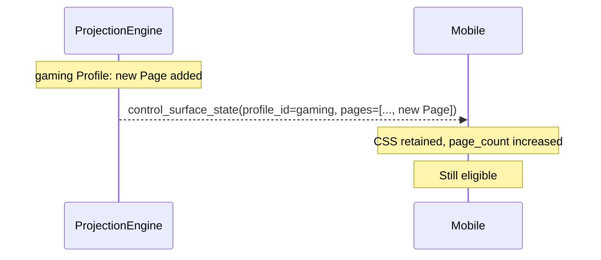

---

## 8. No-Op Suppression — non-structural edit

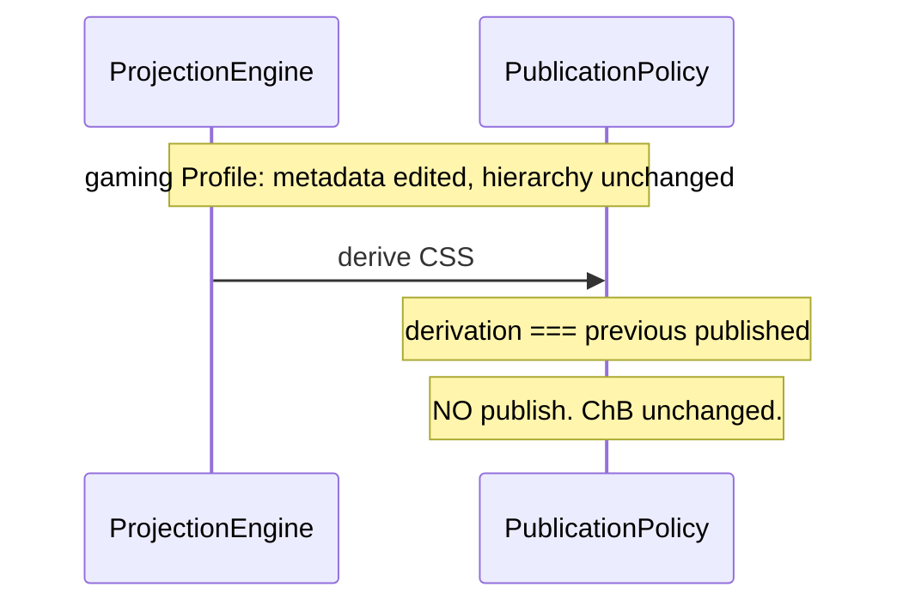

---

## 9. No Active Profile

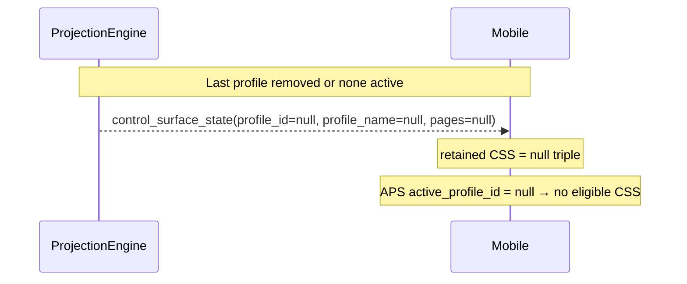

---

## 10. Active Profile with Zero Pages

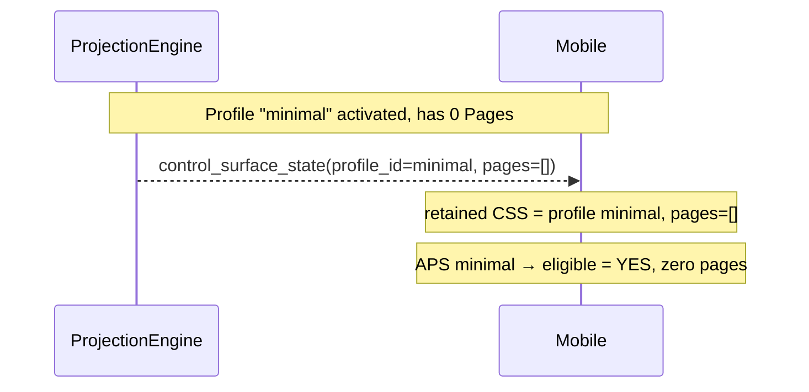

---

## 11. Unresolved Active Profile (Derivation Failure)

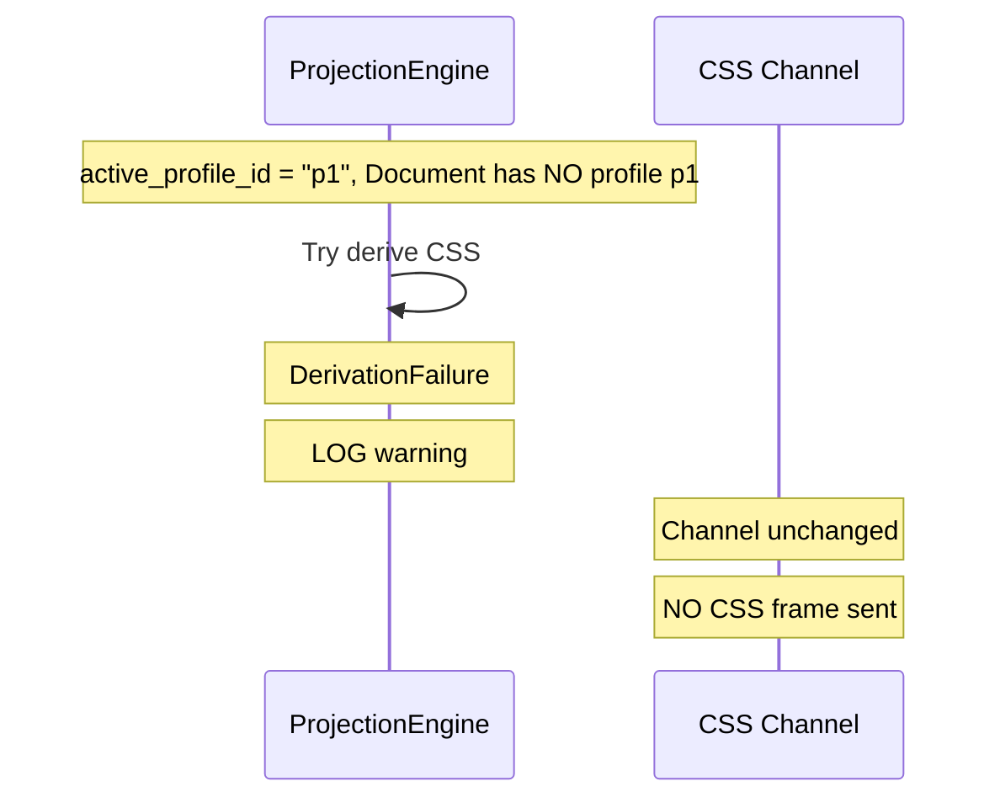

---

## 12. Association Mismatch Retained but Ineligible

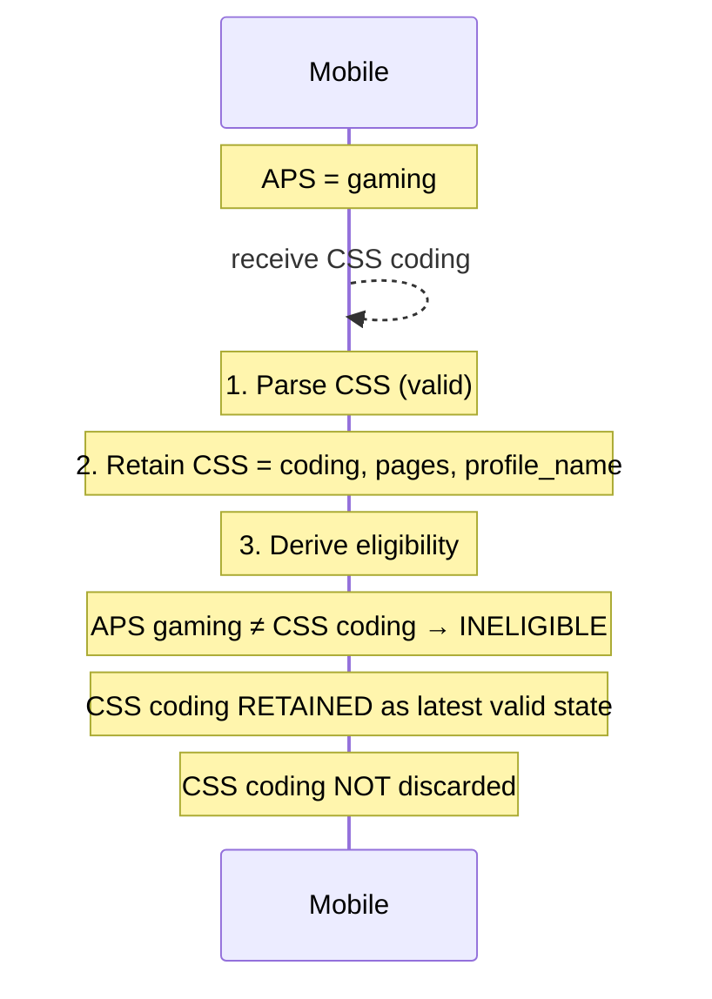

---

## 13. Reconnect — Latest Snapshots

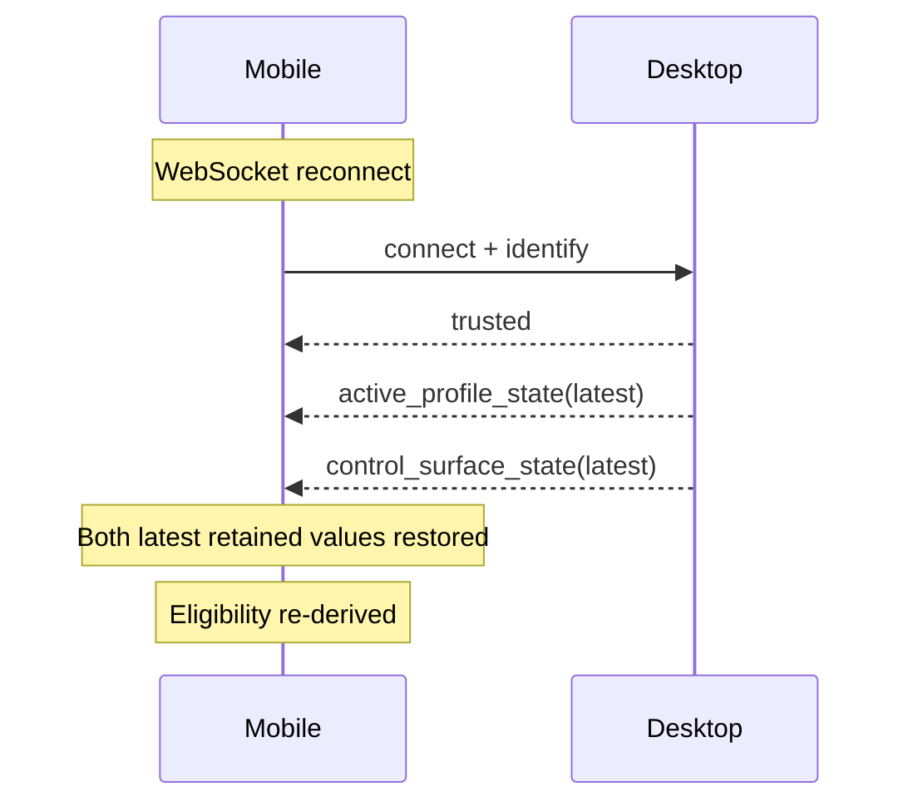

---

## 14. Inactive Profile Edit — No CSS change

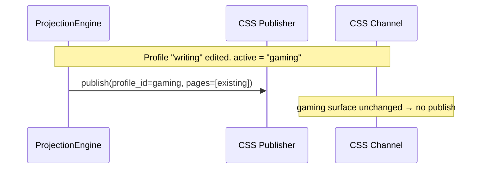

---

## 15. Page Reorder / Button Reorder

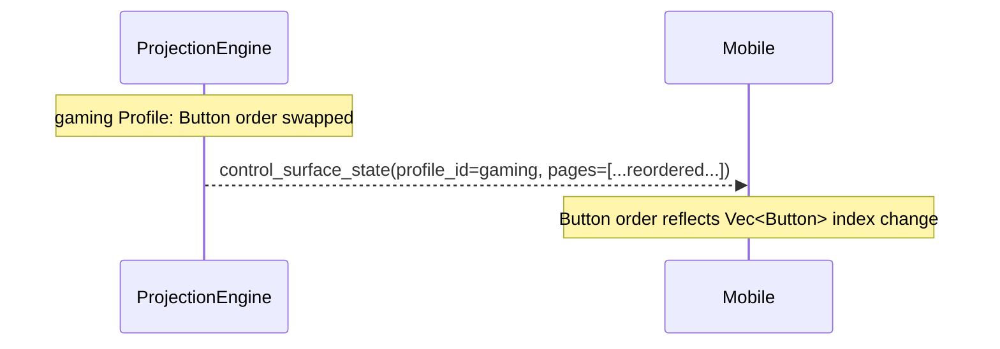

---

## 16. Profile Rename

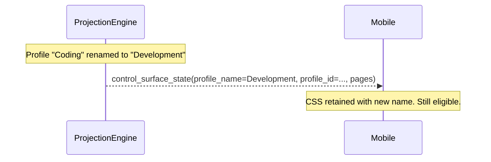
